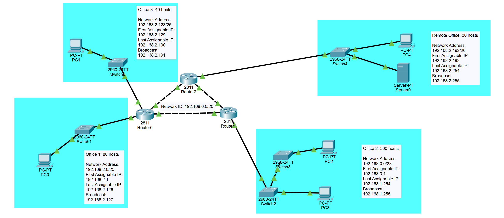

# Networking Practice 3 Cesar Illanes
## 1. Subnetting Assignment

| Subnet Address   | First assignable IP | Last assignable IP | Broadcast     |
|------------------|---------------------|--------------------|---------------|
| 192.168.0.0/23   | 192.168.0.1         | 192.168.1.254      | 192.168.1.255 |
| 192.168.2.0/25   | 192.168.2.1         | 192.168.2.126      | 192.168.1.127 |
| 192.168.2.128/26 | 192.168.2.129       | 192.168.2.190      | 192.168.2.191 |
| 192.168.2.192/26 | 192.168.2.193       | 192.168.2.254      | 192.168.2.255 |

## 2. Terraform Assignment
* You have to configure your account with AWS CLI:
```
aws configure
```
* It is mandatory to change the public key inside the keys.tf with your **own public key** with some of these formats:
  * OpenSSH public key format (the format in ~/.ssh/authorized_keys)
  * Base64 encoded DER format
  * SSH public key file format as specified in RFC4716
* After that, you have to plan the changes with the next command:
```
terraform plan -out NameOfYourPlan
```
* And after you check that the changes are what you actually want, you apply it with the next command:
```
terraform apply NameOfYourPlan
```
